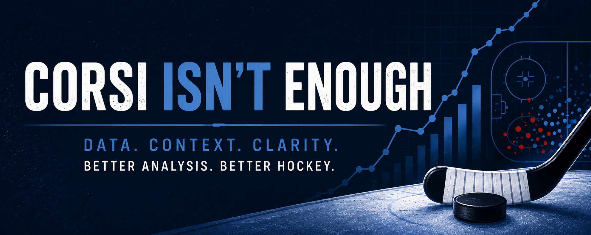

{width="100%" style="border-radius: 8px; margin-bottom: 2rem;"}

### Going deeper than the numbers everyone already knows.

---

If you've spent any time in hockey analytics, you know the surface stats.
Corsi. Fenwick. PP%. PDO. They're useful — but they're also incomplete,
and in some cases quietly misleading.

This site exists because the interesting questions start *after* you've
exhausted what the box score can tell you.

I'm Buddy. I build hockey analytics frameworks from scratch — pulling
directly from the NHL API, doing the math by hand, and writing up what
I find. The work here leans quantitative: expect per-60 measurements,
score-state stratification, sequence analysis, and a lot of Python.
If you're comfortable with WAR, xG, and the idea that context matters,
you'll feel at home.

---

## The Philosophy

Good analytics should be **reproducible**, **explainable**, and
**honest about its assumptions**. Every post includes the math,
the code, and the reasoning. Nothing is a black box.

All notebooks and source code are open on
[GitHub](https://github.com/corsi-isnt-enough/nhl-analytics) —
fork them, critique them, build on them.

---

*Head to [Posts](posts/) to see what's been published.*