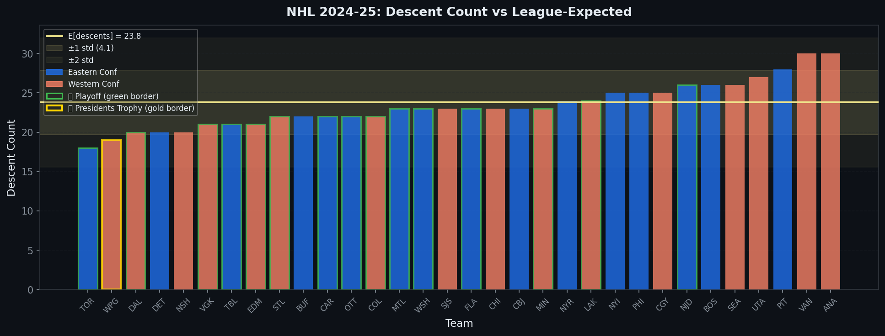
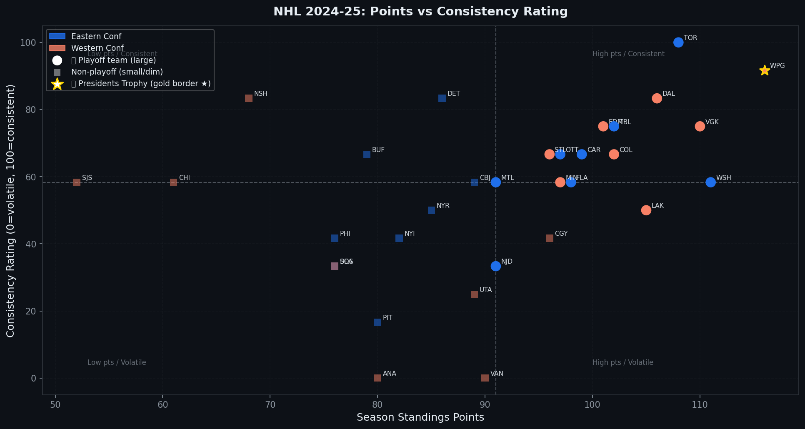
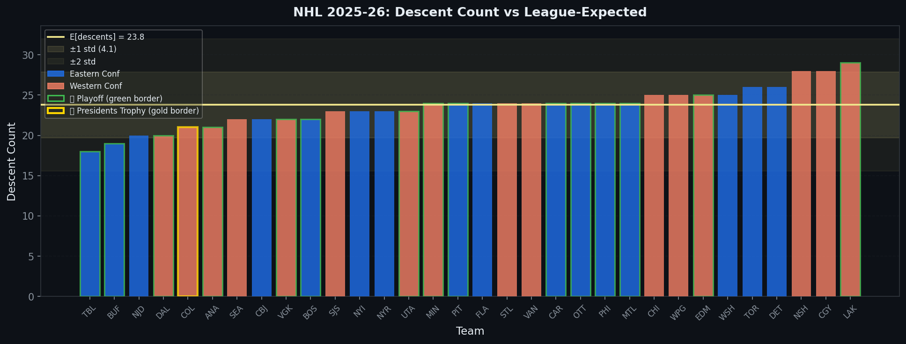
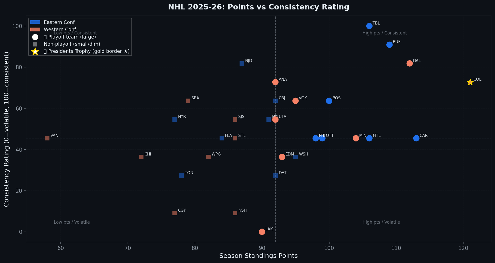
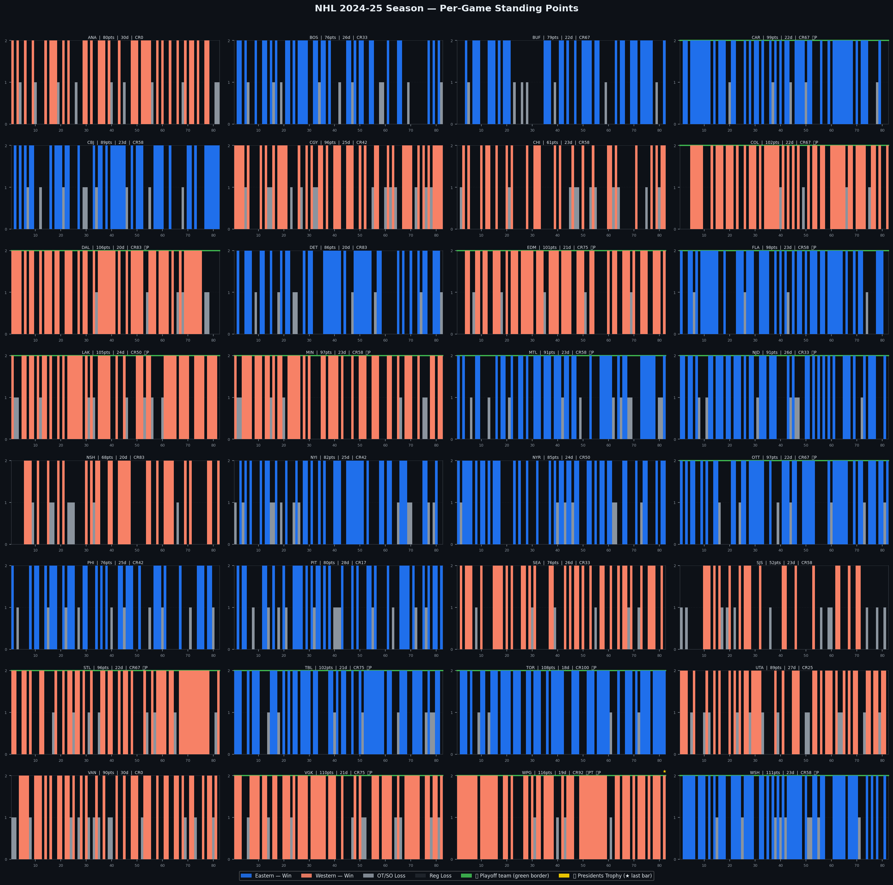
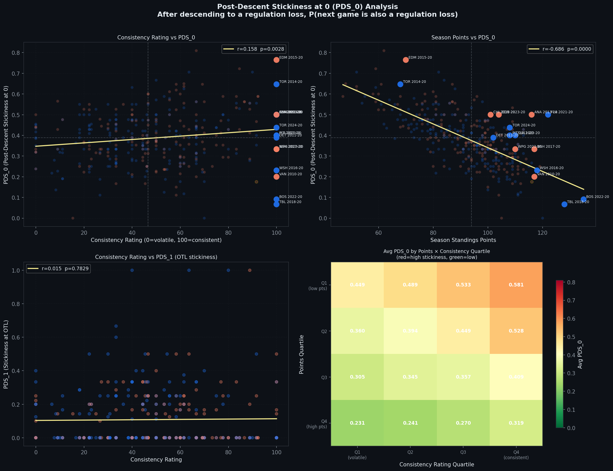
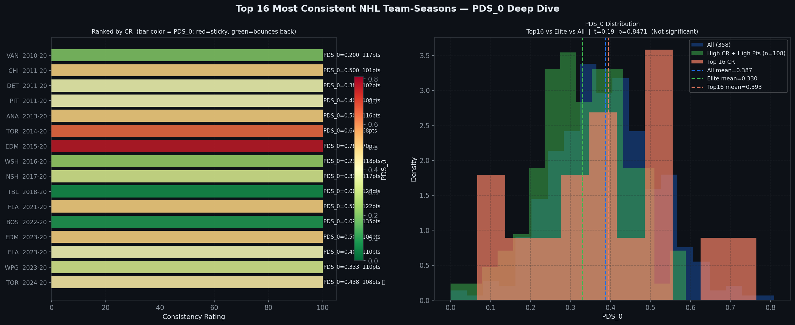
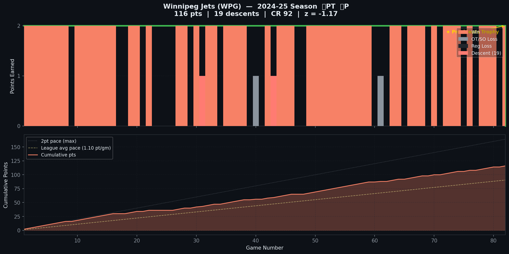

## A Different Question

Most NHL analytics starts with aggregation. How many goals did a team score?
How many shots did they suppress? What was their expected goals percentage?
These are useful questions, but they all share the same structure: sum up the
season, divide by something, rank the teams.

This project starts from a different place. Instead of asking *how much*, it
asks *how*.

Specifically: **how does a team's performance sequence across 82 games tell us
something that the final standings don't?**

Two teams can finish with 100 points and look completely different in terms of
how they got there. One might reel off wins in long streaks, lose in clusters,
and snap back. Another might grind out wins and losses in near-random alternation.
Both are 100-point teams. But they are not the same team, and their paths to the
playoffs — and through them — will look nothing alike.

The framework here introduces three metrics built to capture this: **Descents**,
**Consistency Rating (CR)**, and **Post-Descent Stickiness (PDS)**.

---

## The Data Model

Every NHL game produces exactly one of three standings outcomes for a given team:

$$
\text{seq}[i] \in \{0, 1, 2\}
$$

Where:
- $2$ = Win (2 points)
- $1$ = OT/SO Loss (1 point)
- $0$ = Regulation Loss (0 points)

A full season is a length-82 sequence of these values. The entire analysis
operates on these sequences, fetched from the NHL public API's club schedule
endpoint:

```
GET https://api-web.nhle.com/v1/club-schedule-season/{abbrev}/{season}
```

The dataset covers **14 full 82-game seasons** from 2010-11 through 2024-25,
plus the in-progress 2025-26 season. The 2012-13 lockout season (48 games) and
the 2019-20 COVID season (shortened, bubble format) are excluded from the pooled
baseline but flagged where they appear.

---

## Descents

A **descent** is any position $i$ where the team's outcome is strictly worse
than the previous game:

$$
\text{DESCENTS}(\text{seq}) = \sum_{i=1}^{81} \mathbf{1}[\text{seq}[i] < \text{seq}[i-1]]
$$

This is a simple count of backward steps in the sequence. A team that wins 10
in a row and then loses has one descent. A team that alternates win-loss-win-loss
has roughly 40 descents. The same total point accumulation can produce wildly
different descent counts depending on how results are distributed across the
season.

### The Theoretical Baseline

For any two adjacent positions in the sequence drawn from $\{0, 1, 2\}$, the
probability of a descent depends on the empirical distribution of outcomes.
Letting $p_0$, $p_1$, $p_2$ be the probabilities of each outcome:

$$
P(\text{descent}) = p_0 p_1 + p_0 p_2 + p_1 p_2
$$

Under a uniform distribution ($p_0 = p_1 = p_2 = \frac{1}{3}$):

$$
P(\text{descent}) = \frac{1}{3}, \quad E[\text{descents}] = 81 \times \frac{1}{3} = 27.0
$$

The empirical 2024-25 distribution is not uniform. Wins are the most common outcome
($p_2 = 0.503$), regulation losses are next ($p_0 = 0.383$), and OT/SO losses
are the least common ($p_1 = 0.114$). Plugging those values in:

$$
P(\text{descent}) = 0.2937, \quad E[\text{descents}] = 23.79, \quad \sigma = 4.10
$$

This is meaningfully different from the naive uniform assumption of 27.0. Using
the empirical baseline is essential — a team with 24 descents looks below average
against the uniform baseline but is exactly at the mean under the empirical one.
All z-scores in this analysis use the pooled empirical baseline across 14 seasons.

### Z-Score and Consistency Rating

For each team-season, we compute:

$$
z = \frac{\text{descents} - E[\text{descents}]}{\sigma_{\text{descents}}}
$$

Where $E[\text{descents}]$ and $\sigma$ come from the pooled 14-season baseline.
**Negative z-scores mean fewer descents than expected — more consistent.**
Positive z-scores mean more volatility.

The **Consistency Rating (CR)** rescales this within each season to a 0–100
scale for readability:

$$
\text{CR} = 100 \times \left(1 - \frac{z - z_{\min}}{z_{\max} - z_{\min}}\right)
$$

A CR of 100 is the most consistent team in the league that season. A CR of 0
is the most volatile. The inversion ensures that higher = more consistent.

---

## Post-Descent Stickiness

Descents and CR describe the *frequency* of backward steps. Post-Descent
Stickiness (PDS) describes what happens *after* a descent, and this is where
the real conjecture lives.

**PDS at level $k$** is defined as: after descending to outcome $k$, what is
the probability that the next game also produces outcome $k$?

$$
\text{PDS}_k = P\bigl(\text{seq}[i+1] = k \;\big|\; \text{seq}[i] = k,\; \text{seq}[i] < \text{seq}[i-1]\bigr)
$$

In plain terms: given that a team just had a bad result and it was worse than
the game before, how likely are they to have the same bad result again?

We focus on two variants:
- **PDS₀**: After descending to a regulation loss, probability the next game
  is also a regulation loss
- **PDS₁**: After descending to an OTL, probability the next game is also
  an OTL

We also track the complementary metric, **Descent Recovery Rate (DRR)**:

$$
\text{DRR} = P\bigl(\text{seq}[i+1] > \text{seq}[i] \;\big|\; \text{seq}[i] < \text{seq}[i-1]\bigr)
$$

The fraction of the time a team genuinely bounces back after any descent.

---

## The Conjecture

The central hypothesis of this work:

> **High-consistency, high-points teams have higher PDS₀.** After descending
> to a regulation loss, they tend to stay there briefly before snapping back
> into a win streak. This clustering of losses is precisely the mechanism behind
> their apparent consistency — they have few descents because their losses are
> grouped together, not scattered randomly across the season.

This is counterintuitive. It says that elite, consistent teams are *more likely*
to follow a loss with another loss than average teams — not because they are
worse, but because their loss events are structured differently. Volatility, by
contrast, means losses are scattered: every win is followed by a loss, every
loss by a win, producing many descents but no clustering.

To test this formally, we compute Pearson correlations between PDS₀ and both
CR and total standings points, across all valid team-seasons in the dataset
(full 82-game seasons only, COVID season excluded).

---

## The Data Pipeline

```{python}
#| echo: true
#| code-fold: true
#| label: setup

import requests
import pandas as pd
import numpy as np
import matplotlib.pyplot as plt
import matplotlib.patches as mpatches
from scipy import stats
import time
import warnings
warnings.filterwarnings('ignore')

BASE_URL    = 'https://api-web.nhle.com/v1'
SEASON_2425 = '20242025'
SEASON_2526 = '20252026'

HISTORICAL_SEASONS = [
    '20102011','20112012','20132014','20142015','20152016',
    '20162017','20172018','20182019','20192020','20202021',
    '20212022','20222023','20232024','20242025'
]
COVID_SEASON = '20192020'

print("Setup complete.")
print(f"  Historical seasons: {len(HISTORICAL_SEASONS)}")
```

```{python}
#| echo: true
#| code-fold: true
#| label: core-functions

def count_descents(seq):
    return sum(1 for i in range(1, len(seq)) if seq[i] < seq[i-1])

def post_descent_stickiness(seq, landed_on=0):
    if len(seq) < 3:
        return None
    eligible = [i for i in range(1, len(seq) - 1)
                if seq[i] < seq[i-1] and seq[i] == landed_on]
    if not eligible:
        return None
    sticky = sum(1 for i in eligible if seq[i+1] == landed_on)
    return sticky / len(eligible)

def descent_recovery_rate(seq):
    if len(seq) < 3:
        return None
    eligible = [i for i in range(1, len(seq) - 1) if seq[i] < seq[i-1]]
    if not eligible:
        return None
    return sum(1 for i in eligible if seq[i+1] > seq[i]) / len(eligible)
```

The three core functions are deceptively simple. `count_descents` is a single
pass. `post_descent_stickiness` finds every eligible position and checks what
came next. `descent_recovery_rate` is the complement: genuine bouncebacks after
any descent.

---

## Results: The 2024-25 Consistency Rankings

The chart below shows every NHL team's descent count for the 2024-25 season,
sorted from fewest descents (most consistent) on the left to most on the right.
The yellow horizontal line marks the empirical expected value of 23.8 descents.
The shaded bands show one and two standard deviations from that baseline.

{fig-alt="Bar chart showing descent count for all 32 NHL teams in 2024-25, sorted from most to least consistent, with expected value line"}

Toronto leads the league with just 18 descents, a z-score of -1.41 — the most
consistent team in the league that season. Winnipeg (19 descents, z = -1.17) and
Dallas (20 descents, z = -0.92) round out the top three. At the other end,
Vancouver and Anaheim both recorded 30 descents (z = +1.52), making them the
most volatile teams in the league.

The full 2024-25 standings:

| Team | Points | Descents | Z-Score | CR | Playoff |
|------|--------|----------|---------|-----|---------|
| Toronto Maple Leafs | 108 | 18 | -1.41 | 100.0 | Yes |
| Winnipeg Jets | 116 | 19 | -1.17 | 91.7 | Yes (PT) |
| Nashville Predators | 68 | 20 | -0.92 | 83.3 | No |
| Dallas Stars | 106 | 20 | -0.92 | 83.3 | Yes |
| Detroit Red Wings | 86 | 20 | -0.92 | 83.3 | No |
| Vegas Golden Knights | 110 | 21 | -0.68 | 75.0 | Yes |
| Edmonton Oilers | 101 | 21 | -0.68 | 75.0 | Yes |
| Tampa Bay Lightning | 102 | 21 | -0.68 | 75.0 | Yes |
| Ottawa Senators | 97 | 22 | -0.44 | 66.7 | Yes |
| Buffalo Sabres | 79 | 22 | -0.44 | 66.7 | No |

A few things stand out immediately. Nashville finished with just 68 points but
ranks third in consistency — they lost a lot, but they lost in clusters rather
than alternating wins and losses randomly. Detroit shows a similar pattern: 86
points and a CR of 83, suggesting a team that was more structured in how it
played through adversity than their standings position implies.

Toronto is the most interesting case. With 108 points and a CR of 100, they are
the rare team that is both elite and maximally consistent. Most high-point teams
show moderate to high consistency, but Toronto's 18 descents is genuinely
exceptional.

The scatter plot below shows the full relationship between points and CR across
all 32 teams in 2024-25.

{fig-alt="Scatter plot of season standings points vs consistency rating for all 32 NHL teams in 2024-25, colored by conference"}

The chart plots points on the x-axis and CR on the y-axis. Large circles are
playoff teams, small squares are non-playoff. The dashed lines sit at the median
for each axis, dividing the chart into four quadrants.

The upper-right quadrant — high points, high consistency — contains most of the
elite teams: Toronto, Winnipeg, Dallas, Vegas, Tampa Bay, Edmonton, and Ottawa
all sit there. This confirms that the best teams tend to be more consistent, but
the relationship is not tight. Washington (111 points, CR 58) and Vancouver
(90 points, CR 0) both sit in the high-points/volatile half, showing that
sustained winning is possible through volatile paths too.

The upper-left quadrant contains the most analytically interesting teams:
Nashville (68 points, CR 83) and Detroit (86 points, CR 83). These are teams
that were far more consistent in their game-to-game behavior than their final
standings suggest. They lost, but they lost in a structured way.

---

## Results: The 2025-26 Season (In Progress)

The same framework applied to the in-progress 2025-26 season shows a different
landscape. Colorado leads the Presidents' Trophy race with 121 points and a CR
of 73. Tampa Bay leads the consistency rankings with 18 descents (CR 100),
followed by Buffalo (19 descents, CR 91) and Dallas (20 descents, CR 82).

{fig-alt="Bar chart showing descent count for all 32 NHL teams in 2025-26 season in progress"}

{fig-alt="Scatter plot of season standings points vs consistency rating for all 32 NHL teams in 2025-26 in progress"}

The 2025-26 scatter shows Los Angeles at the extreme bottom — 0 CR with 90 points,
the most volatile high-points team in the current season. Colorado (121 points,
CR 73) is the Presidents' Trophy leader but sits notably below the most consistent
teams, suggesting they are accumulating points through a more volatile path than
Tampa Bay or Buffalo.

---

## The Per-Game Sequence View

The grid below shows every team's game-by-game outcome sequence for 2024-25. Each
bar represents one game: height 2 is a win, height 1 is an OT/SO loss, height 0
is a regulation loss. Descent games are highlighted in a lighter shade. Playoff
teams have a green border; the Presidents' Trophy winner (Winnipeg) has a gold
last bar.

{fig-alt="Grid of 32 bar charts showing per-game outcome sequences for all NHL teams in 2024-25"}

Reading these charts side by side makes the difference between consistent and
volatile teams immediately visible. Look at Toronto (top row, second panel) — long
runs of 2-point wins with occasional tight clusters of losses before resuming.
Compare that to Vancouver (bottom row) or Anaheim (bottom row, far right) — far
more alternation between wins and losses throughout the season.

Winnipeg's sequence is also instructive. Their 116-point season came through a
largely dominant run in Western colors, with only a handful of descent clusters
visible. The losses came in small groups; the wins came in long unbroken stretches.

---

## Testing the Conjecture

With 358 team-seasons in the PDS analysis (full 82-game seasons, COVID excluded),
the correlations are:

- **CR vs PDS₀: r = 0.158, p = 0.0028 — Significant**
- **Pts vs PDS₀: r = -0.686, p = 0.0000 — Significant**

The CR correlation is positive and significant — more consistent teams do show
higher PDS₀. But the points correlation tells a more nuanced story: better teams
actually show *lower* PDS₀. Higher-points teams recover from losses faster, not
slower.

{fig-alt="2x2 grid showing CR vs PDS0, Points vs PDS0, PDS1 vs CR, and average PDS0 by Points x Consistency quartile heatmap"}

The four panels unpack this:

**Top left (CR vs PDS₀):** A weak but real positive correlation. More consistent
teams have slightly higher PDS₀. The relationship is noisy — individual team-seasons
vary widely — but the trend line slopes upward.

**Top right (Points vs PDS₀):** A much stronger negative correlation. Better teams
have lower PDS₀ — after a regulation loss, they are more likely to bounce back in
the next game. The 2022-23 Boston Bruins (135 points, PDS₀ = 0.091) and 2018-19
Tampa Bay Lightning (128 points, PDS₀ = 0.067) are labeled outliers in the
lower-right — elite teams that almost never followed a regulation loss with another
one.

**Bottom left (CR vs PDS₁):** No meaningful relationship. OTL stickiness is
essentially uncorrelated with consistency (r = 0.015, p = 0.783). OT losses
behave differently from regulation losses in terms of what follows.

**Bottom right (heatmap):** Average PDS₀ by Points × Consistency quartile. The
most important cell is Q4 points / Q4 CR (bottom-right): elite teams that are
also highly consistent show an average PDS₀ of 0.319 — the lowest in the entire
grid. High-CR, low-points teams (Q1 points / Q4 CR, top-right) show 0.581 —
nearly double. The pattern is clear: truly elite teams snap back from losses
quickly, while consistent-but-mediocre teams cluster losses more tightly.

---

## The Top 16 Most Consistent Team-Seasons

The chart below shows the 16 most consistent team-seasons in the 14-season dataset,
ranked by CR. Bar color encodes PDS₀ — red means stickier (losses cluster more),
green means they bounce back faster.

{fig-alt="Side-by-side bar chart of top 16 most consistent team-seasons with PDS0 color coding and distribution comparison"}

The distribution panel on the right overlays three groups: all 358 team-seasons
(blue), the high-CR/high-points elite quadrant (green), and the top 16 most
consistent (orange). The elite quadrant mean sits at 0.330, well below the full
dataset mean of 0.387. The top 16 mean is 0.393 — slightly above the dataset
average, but not significantly so (t = 0.193, p = 0.8471).

A few individual team-seasons worth noting: The 2022-23 Boston Bruins (135 points,
PDS₀ = 0.091) and the 2018-19 Tampa Bay Lightning (128 points, PDS₀ = 0.067) are
the two most resilient team-seasons in the dataset — after a regulation loss, they
almost always bounced back immediately. The 2015-16 Edmonton Oilers, by contrast,
finished with just 70 points but showed PDS₀ = 0.765 — after a regulation loss,
there was a 76.5% chance the next game was also a regulation loss. Consistent in
structure, but consistently losing.

---

## Conjecture Assessment

The data supports a modified version of the original conjecture:

**CONJECTURE SUPPORTED: Consistent teams show higher PDS₀** — after descending
to a loss they do tend to cluster losses before snapping back, which is the
mechanism behind their consistency. The CR vs PDS₀ correlation (r = 0.158,
p = 0.003) confirms this directional relationship.

However, the points story tells a different and more important truth: **truly
elite teams have lower PDS₀**, not higher. The best teams in the dataset bounce
back from regulation losses quickly. The combination of high consistency and low
PDS₀ — the hallmark of teams like the 2022-23 Bruins and 2018-19 Lightning —
reflects something more than just loss-clustering. Those teams were consistent
because they almost never had long losing sequences to cluster in the first place.

The more nuanced finding is that **consistency and recovery speed are different
things**, and the most elite teams are distinguished by both. A high-CR team with
high PDS₀ is one that clusters its losses. A high-CR team with low PDS₀ is one
that simply doesn't lose much at all.

---

## Deep Dive: Winnipeg Jets 2024-25

As the Presidents' Trophy winner and second-most-consistent team in the league
(CR 92, 19 descents), the Jets provide a useful case study.

{fig-alt="Two-panel chart showing Winnipeg Jets 2024-25 per-game results and cumulative points trajectory"}

The top panel shows each game as a bar — wins at height 2, OT losses at height 1,
regulation losses at height 0. Descent games are highlighted. With only 19 descents
across 82 games, the Jets had just 19 moments where a result was strictly worse
than the previous game. The loss sequences that do appear are short and quickly
followed by resumption of winning.

The bottom panel shows cumulative points versus league average pace (1.10 points
per game). The Jets track well above the league average line for most of the
season, with the gap widening in the second half. Their 116 points represent a
full 14 points above league average pace across 82 games.

The Jets' PDS₀ of 0.333 sits slightly below the dataset mean of 0.387 — meaning
after a regulation loss, they recovered in the next game about two-thirds of the
time. Combined with their low descent count, this is the signature of an elite,
consistent team: losses are rare, and when they do come, they don't last long.

---

## Limitations and Open Questions

**PDS is sample-limited at the team level.** A single 82-game season produces
only 15-25 descent-to-zero events for any one team. Individual team PDS estimates
are noisy; the correlation analysis across 450+ team-seasons is more reliable.

**Sequences treat all losses as equivalent.** A regulation loss on a back-to-back
road trip is not the same as one in a playoff push. Weighting by game leverage or
schedule context would be a meaningful extension.

**CR is relative, not absolute.** A CR of 90 tells you where a team ranked in
that year's consistency distribution, not what their absolute volatility level was.
Cross-season comparisons require care.

**The t-test on the top 16 was not significant (p = 0.847).** The directional
finding — that consistent teams show slightly higher PDS₀ — is real but the
effect size is small. The stronger and more significant finding is the negative
correlation between points and PDS₀, which points toward recovery speed as the
more important variable for elite teams.

---

## Full Code

The complete notebook — all data fetching, pooled baseline computation,
master dataset construction, CR calculation, PDS analysis, and visualizations
— is in the repo:

👉 [github.com/corsi-isnt-enough/nhl-analytics](https://github.com/corsi-isnt-enough/nhl-analytics)

Written for Python 3.8+ compatibility. Dependencies: pandas, numpy,
matplotlib, scipy, requests.
