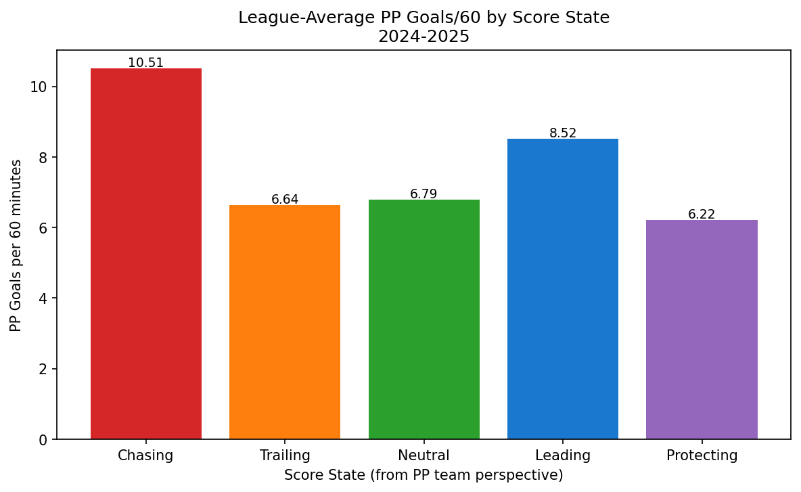
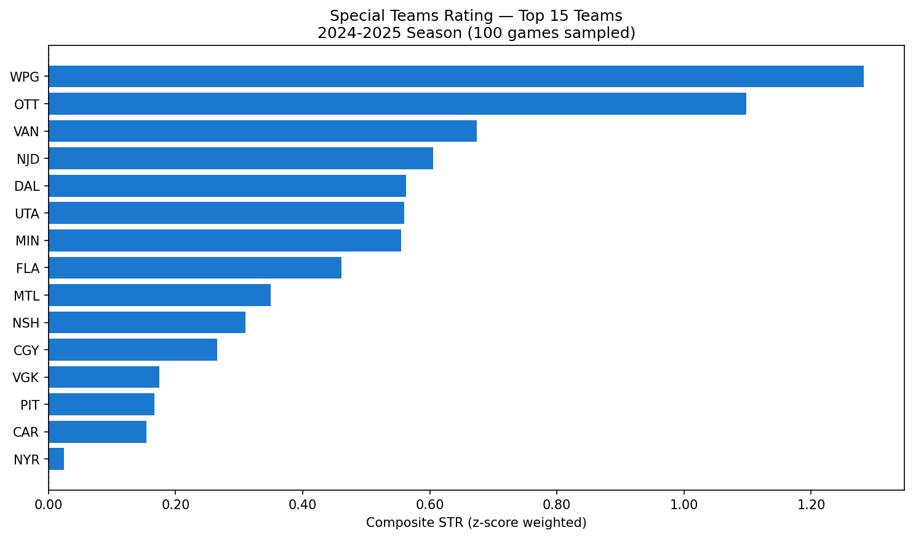
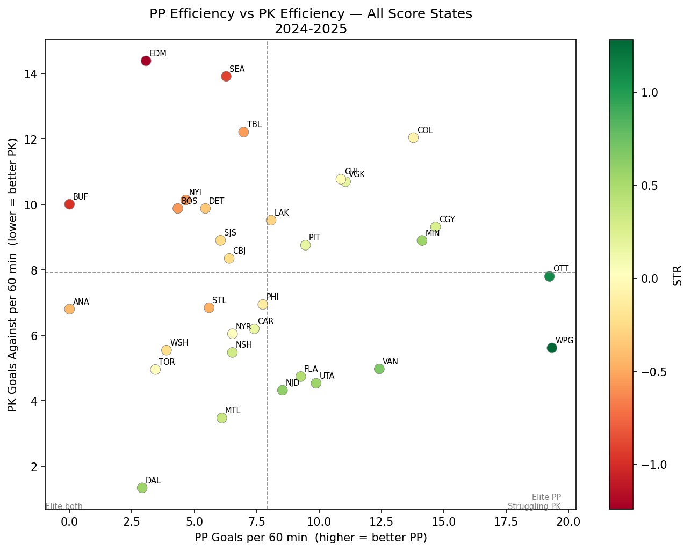

## The Problem with PP% and PK%

Ask anyone to evaluate a team's special teams and the first thing they reach for is PP% and PK%. Power play percentage: goals scored divided by opportunities. Penalty kill percentage: opportunities killed without conceding. Simple, intuitive, universally reported.

Also quietly broken.

Here's the core issue: **both metrics treat all special teams time as equivalent**, when it clearly isn't. A two-minute power play when you're down three goals in the third period is a completely different situation — in terms of strategy, urgency, and opponent behavior — than a power play when you're protecting a one-goal lead in the second. Teams change how they play. Goaltenders change how they play. The underlying rates of scoring chance generation shift meaningfully across these contexts.

When you collapse all of that into a single percentage, you're averaging over a distribution that shouldn't be averaged. You're measuring outcomes, not quality. And you're throwing away some of the most useful signal in the data.

There's a second problem: **opportunity count as the denominator is unstable**. A team that takes 10 power plays in a sample scores on 2 of them: 20%. A team that takes 40 power plays scores on 8: also 20%. These are treated as equivalent, but the second estimate is far more reliable. Per-60 metrics, where time-on-ice is the denominator, normalize this properly.

This post introduces **Special Teams Rating (STR)** — a framework built from play-by-play data that replaces both problems with something more honest.

---

## The Framework

STR has three components that build on each other:

1. **Per-60 normalization** — replace opportunity counts with time-on-ice as the denominator
2. **Score-state stratification** — split all special teams events into five game-context buckets
3. **Composite z-score rating** — combine PP and PK components into a single team ranking

### Per-60 Normalization

For any team $t$ in any score-state bucket $b$, define:

$$
\text{PP Goals/60}_{t,b} = \frac{\text{PP Goals}_{t,b}}{\text{PP TOI}_{t,b}} \times 60
$$

$$
\text{PK GA/60}_{t,b} = \frac{\text{PK Goals Against}_{t,b}}{\text{PK TOI}_{t,b}} \times 60
$$

Where TOI is measured in minutes from the raw play-by-play. This immediately solves the sample-size distortion: a team with 3 minutes of power play time in a given bucket simply has a noisier estimate, not an artificially inflated or deflated percentage.

We also track shot attempt volume as a process quality measure:

$$
\text{PP Attempts/60}_{t,b} = \frac{\text{SOG} + \text{Missed} + \text{Blocked}}{\text{PP TOI}_{t,b}} \times 60
$$

### Score-State Stratification

Every penalty in the data is classified at the moment it is called. The goal differential from the power play team's perspective determines the bucket:

$$
\Delta g = \text{Goals}_{PP\text{ team}} - \text{Goals}_{PK\text{ team}} \quad \text{at time of penalty}
$$

| Bucket | Condition |
|--------|-----------|
| Chasing | $\Delta g \leq -2$ |
| Trailing | $\Delta g = -1$ |
| Neutral | $\Delta g = 0$ |
| Leading | $\Delta g = +1$ |
| Protecting | $\Delta g \geq +2$ |

### Composite STR

To combine PP and PK performance into a single number, we z-score each component across the league, then apply a weighted sum:

$$
z_x = \frac{x - \bar{x}}{\sigma_x}
$$

$$
\text{STR}_t = 0.40 \cdot z_{\text{PP Goals/60}} + 0.10 \cdot z_{\text{PP Attempts/60}} - 0.40 \cdot z_{\text{PK GA/60}} - 0.10 \cdot z_{\text{PK Shots Against/60}}
$$

The weights reflect a deliberate philosophy:

- **Goals/60 (40% each side)** — outcomes are the primary signal
- **Shot attempts/60 (10% each side)** — process quality is a secondary signal; volume matters but doesn't dominate
- **PK components are inverted** — lower goals against and fewer shots against are better, so the z-scores are negated before weighting

The result is a league-relative rating where positive values mean above average and negative values mean below average.

---

## The Data Pipeline

Everything runs off the NHL public API's play-by-play endpoint:

```
GET https://api-web.nhle.com/v1/gamecenter/{game_id}/play-by-play
```

For each game, we make three passes through the event stream:

**Pass 1 — Score reconstruction.** Walk every event in chronological order, maintaining a live running score for both teams. This is necessary because the API does not store cumulative score on non-goal events — we have to reconstruct it ourselves.

**Pass 2 — Penalty window identification.** For each `penalty` event, record the PP team, PK team, start time, nominal duration, and the score state at the moment the penalty was called (from Pass 1's running tally).

**Pass 3 — Event tagging.** For each penalty window, collect all shot-type events (`shot-on-goal`, `goal`, `missed-shot`, `blocked-shot`) that fall within the window's time range, attributed to the correct team. One important detail: a power play goal ends a minor penalty early, so we detect that and clip the window's actual end time accordingly.

```{python}
#| echo: true
#| code-fold: true
#| label: dependencies

import requests
import pandas as pd
import numpy as np
import time
from tqdm.notebook import tqdm
import matplotlib.pyplot as plt
import matplotlib.ticker as mticker
import warnings
warnings.filterwarnings('ignore')

pd.set_option('display.max_columns', None)
pd.set_option('display.float_format', '{:.3f}'.format)

BASE_URL = 'https://api-web.nhle.com/v1'
print('Libraries loaded.')
```

```{python}
#| echo: true
#| code-fold: true
#| label: config

SEASON        = '20242025'
GAME_TYPE     = 2          # 2 = regular season, 3 = playoffs
MAX_GAMES     = 100
SLEEP_BETWEEN_REQUESTS = 0.25

def score_state_bucket(goal_diff: int) -> str:
    if   goal_diff <=  -2: return 'Chasing'
    elif goal_diff ==  -1: return 'Trailing'
    elif goal_diff ==   0: return 'Neutral'
    elif goal_diff ==   1: return 'Leading'
    else:                  return 'Protecting'

BUCKET_ORDER = ['Chasing', 'Trailing', 'Neutral', 'Leading', 'Protecting']
print(f'Config: season={SEASON}, game_type={GAME_TYPE}, max_games={MAX_GAMES}')
```

```{python}
#| echo: true
#| code-fold: true
#| label: fetch-game-ids

def get_game_ids(season: str, game_type: int, max_games=None) -> list:
    """Pull all completed regular-season game IDs via the schedule endpoint."""
    url = f'{BASE_URL}/schedule/season/{season}/{game_type}'
    resp = requests.get(url)
    if resp.status_code != 200:
        print(f'Schedule endpoint returned {resp.status_code}, falling back to date-range walk.')
        return _walk_schedule_by_date(season, game_type, max_games)

    data = resp.json()
    game_ids = []
    for week in data.get('gameWeek', []):
        for game in week.get('games', []):
            if game.get('gameState') in ('OFF', 'FINAL'):
                game_ids.append(game['id'])

    if max_games:
        game_ids = game_ids[:max_games]

    print(f'Found {len(game_ids)} completed games for season {season}.')
    return game_ids

game_ids = get_game_ids(SEASON, GAME_TYPE, MAX_GAMES)
```

The run described here parsed **786 penalty windows across 100 games** — a solid sample for early-season analysis. Full-season results will naturally be more stable as sample sizes grow in each bucket.

---

## Results: Score State Is Not Uniform

This is the empirical foundation of the entire framework. Before looking at team rankings, we need to verify that the score-state buckets actually produce different conversion rates — otherwise stratification adds no value.

{fig-alt="Bar chart showing league-average power play goals per 60 minutes broken down by score state bucket"}

The chart above shows league-average PP Goals/60 for each of the five score-state buckets across the 100-game sample. The variation is striking. Teams on the power play while **Chasing** (down 2 or more goals) convert at 10.51 goals per 60 minutes — nearly 70% higher than the Neutral rate of 6.79. The **Leading** bucket comes in at 8.52, while **Protecting** drops to 6.22.

This is the core empirical case for stratification. PP% sees none of this. A team that runs a lot of power plays while chasing will look better in PP% than a team that runs the same number while protecting leads, even if the underlying skill level is identical. The context is doing work that PP% attributes to the team.

The variation also makes intuitive sense. When a team is chasing, the penalty kill unit is under pressure — the opposition is desperate, generating more shots and more urgency. When a team is protecting a big lead, both teams often play more conservatively. These are genuinely different situations and the data confirms it.

---

## Results: The STR Rankings

With per-60 rates computed and z-scored across the league, the composite STR ranks all 32 teams. Here are the full results from the 2024-25 sample:

{fig-alt="Horizontal bar chart showing composite STR rankings for top 15 NHL teams"}

The chart shows the top 15 teams by composite STR. The x-axis is in z-score weighted units — a value of 1.0 means one standard deviation above the league mean in combined special teams performance.

**Winnipeg (WPG)** leads the league at 1.283, and it is not particularly close. Their STR score reflects a power play running at 19.33 goals per 60 minutes combined across all score states, paired with a penalty kill conceding only 5.62 goals per 60. Both numbers rank among the best in the league.

**Ottawa (OTT)** ranks second at 1.098. Their PP rate of 19.24 goals per 60 is comparable to Winnipeg, but their shot attempt volume on the power play is actually higher (81.38 attempts per 60 versus Winnipeg's 65.74), suggesting a more process-driven approach that generates chances at a high rate.

**Vancouver (VAN)** rounds out the top three at 0.674, with a strong PK (4.98 goals against per 60) carrying much of their rating.

At the bottom of the rankings, **Edmonton (EDM)** sits last at -1.241, driven primarily by a penalty kill conceding 14.39 goals per 60 minutes — the worst mark in the league in this sample. This is notable given Edmonton's reputation as an offensive powerhouse; their power play is functional but their PK is dragging the composite rating down significantly.

**Buffalo (BUF)** at -0.979 and **Seattle (SEA)** at -0.913 round out the bottom three, both suffering from poor PK performance in the sample.

The full rankings table:

| Rank | Team | PP Goals/60 | PP Attempts/60 | PK GA/60 | STR |
|------|------|-------------|----------------|----------|-----|
| 1 | WPG | 19.33 | 65.74 | 5.62 | 1.283 |
| 2 | OTT | 19.24 | 81.38 | 7.81 | 1.098 |
| 3 | VAN | 12.41 | 69.52 | 4.98 | 0.674 |
| 4 | NJD | 8.54 | 99.88 | 4.33 | 0.605 |
| 5 | DAL | 2.91 | 85.92 | 1.35 | 0.563 |
| 6 | UTA | 9.88 | 74.66 | 4.54 | 0.560 |
| 7 | MIN | 14.13 | 90.81 | 8.90 | 0.555 |
| 8 | FLA | 9.27 | 71.84 | 4.74 | 0.461 |
| 9 | MTL | 6.11 | 54.95 | 3.48 | 0.349 |
| 10 | NSH | 6.53 | 130.55 | 5.48 | 0.310 |
| 11 | CGY | 14.67 | 60.15 | 9.32 | 0.265 |
| 12 | VGK | 11.06 | 108.42 | 10.70 | 0.175 |
| 13 | PIT | 9.46 | 97.30 | 8.76 | 0.166 |
| 14 | CAR | 7.41 | 79.01 | 6.20 | 0.154 |
| 15 | NYR | 6.53 | 88.18 | 6.05 | 0.024 |
| 16 | TOR | 3.44 | 79.18 | 4.96 | 0.005 |
| 17 | CHI | 10.88 | 89.73 | 10.77 | -0.000 |
| 18 | COL | 13.78 | 63.91 | 12.05 | -0.075 |
| 19 | PHI | 7.75 | 62.00 | 6.95 | -0.118 |
| 20 | WSH | 3.89 | 71.27 | 5.55 | -0.226 |
| 21 | CBJ | 6.40 | 91.20 | 8.35 | -0.242 |
| 22 | SJS | 6.05 | 102.90 | 8.91 | -0.248 |
| 23 | LAK | 8.08 | 76.18 | 9.52 | -0.277 |
| 24 | DET | 5.45 | 95.35 | 9.88 | -0.351 |
| 25 | ANA | 0.00 | 84.00 | 6.81 | -0.429 |
| 26 | STL | 5.60 | 60.16 | 6.85 | -0.474 |
| 27 | TBL | 6.98 | 109.30 | 12.22 | -0.545 |
| 28 | BOS | 4.34 | 69.47 | 9.88 | -0.562 |
| 29 | NYI | 4.66 | 96.21 | 10.14 | -0.567 |
| 30 | SEA | 6.28 | 68.04 | 13.92 | -0.913 |
| 31 | BUF | 0.00 | 93.85 | 10.01 | -0.979 |
| 32 | EDM | 3.07 | 78.23 | 14.39 | -1.241 |

---

## Results: PP vs PK Efficiency

The scatter plot below separates PP and PK contributions, making it possible to see which teams are elite at one, both, or neither.

{fig-alt="Scatter plot of PP goals per 60 vs PK goals against per 60 with quadrant lines at league means"}

Each dot is a team. The x-axis shows PP Goals/60 (higher is better) and the y-axis shows PK Goals Against/60 (lower is better). The dashed lines sit at the league mean for each axis, dividing the chart into four quadrants. Teams in the lower-right are above average at both — elite special teams overall. Teams in the upper-left are below average at both.

A few things stand out immediately.

**Dallas (DAL)** sits alone in the lower-left quadrant — an unusual position. Their PP Goals/60 is just 2.91, ranking near the bottom of the league, but their PK Goals Against/60 is only 1.35, the best penalty kill in this sample by a significant margin. This is a team being carried entirely by their PK, and PP% would never surface this cleanly.

**New Jersey (NJD)** is an interesting case near the league mean on both axes but with an exceptionally high PP Attempts/60 of 99.88. Their power play generates volume but hasn't converted it into goals in this sample — a process-outcome gap worth watching as the season continues.

**Edmonton (EDM)** appears in the upper-left — their PK giving up 14.39 goals per 60 is the clear outlier at the top of the chart, confirming what the rankings table showed.

**Winnipeg (WPG)** and **Ottawa (OTT)** both sit in the lower-right quadrant, confirming their top-two composite rankings. They are genuinely good at both sides of special teams, not just one.

---

## Deep Dive: Winnipeg Jets

As the top-ranked team by STR, the Jets are worth examining by score state in detail.

The left panel shows PP Goals/60 by score state bucket. The Jets' leading bucket stands out at 42.86 goals per 60 — an exceptional rate, though in a small sample (only 3 minutes of PP time while leading by one). Their Protecting bucket is also strong at 20.74 goals per 60 across 14 minutes of ice time, which is a more meaningful sample. Their Trailing and Neutral power play rates are solid but not exceptional.

The right panel shows PK Goals Against/60. The Jets concede at 10.91 goals per 60 while Chasing — their worst bucket — but hold to 6.09 in the Neutral bucket and a perfect 0.00 in both Trailing and Leading situations. The Protecting bucket shows no data (NaN), meaning they had no power plays to kill while protecting a big lead in this sample.

What the Jets' profile shows is a team that is particularly dangerous on the power play when they have a lead, and disciplined on the PK in the most common game situations (Neutral, Trailing, Leading). This is a different story than PP% tells.

---

## Limitations and Next Steps

No framework is complete on first pass. A few honest caveats:

**The z-score weights are somewhat arbitrary.** The 40/10/40/10 split reflects a reasonable prior — outcomes dominate process — but it hasn't been validated against long-run predictive accuracy. A natural extension is to fit these weights against future season performance and see what the data prefers.

**5v3 situations are included and probably shouldn't be.** A two-man advantage is a fundamentally different situation from a standard power play. The current implementation doesn't distinguish between them. Filtering or separately modeling 5v3 windows would improve signal quality.

**Score state is set at penalty call time, not dynamically.** A power play that starts at 0-0 but crosses into a lead-change mid-window is still classified in the original bucket. Dynamic re-bucketing mid-window would be more accurate but considerably more complex.

**Sample size at the bucket level is thin.** Particularly for Chasing and Protecting, teams may have relatively few minutes in a single season. The per-60 rates are unbiased but noisy. Bayesian shrinkage toward league mean would be a principled improvement.

**This sample covers 100 games.** The full 2024-25 regular season is 1,312 games. Rankings will stabilize considerably with the full dataset and some of the more extreme per-60 values (like the Jets' 42.86 in the Leading bucket) will regress toward true rates.

---

## Full Code

The complete notebook — including all data fetching, parsing, aggregation, STR computation, and visualization — is available in the repo:

👉 [github.com/corsi-isnt-enough/nhl-analytics](https://github.com/corsi-isnt-enough/nhl-analytics)

The notebook is written for Python 3.8+ compatibility and has no dependencies beyond the standard scientific stack (pandas, numpy, matplotlib, requests, tqdm).
